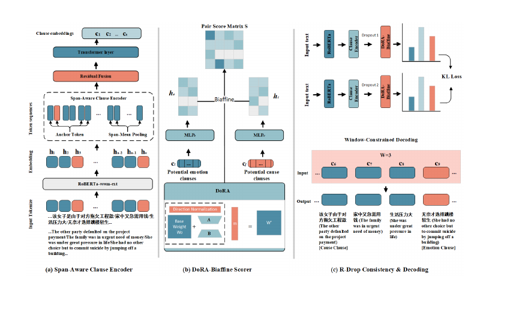
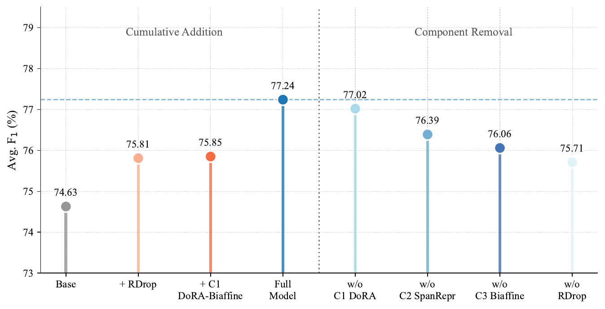
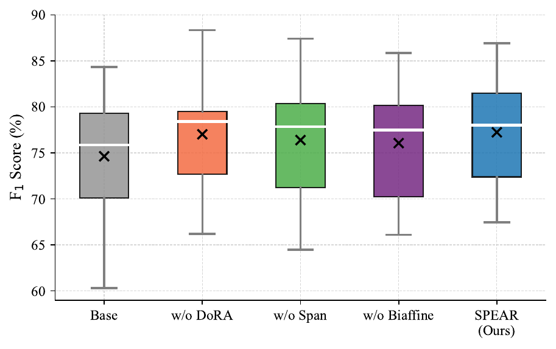
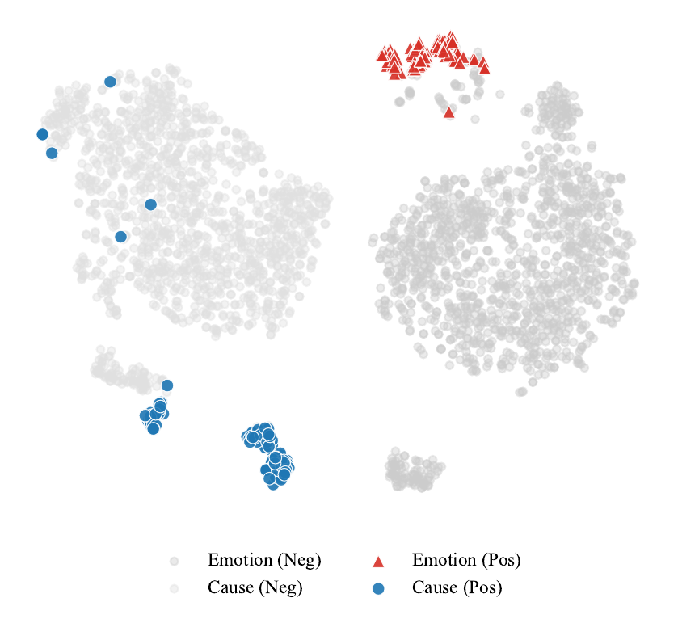
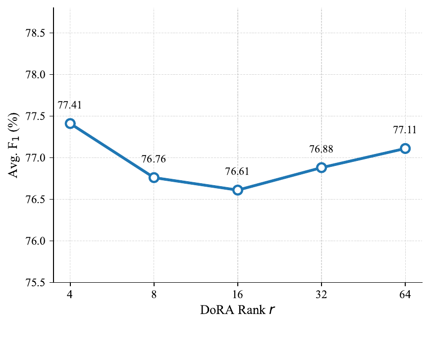
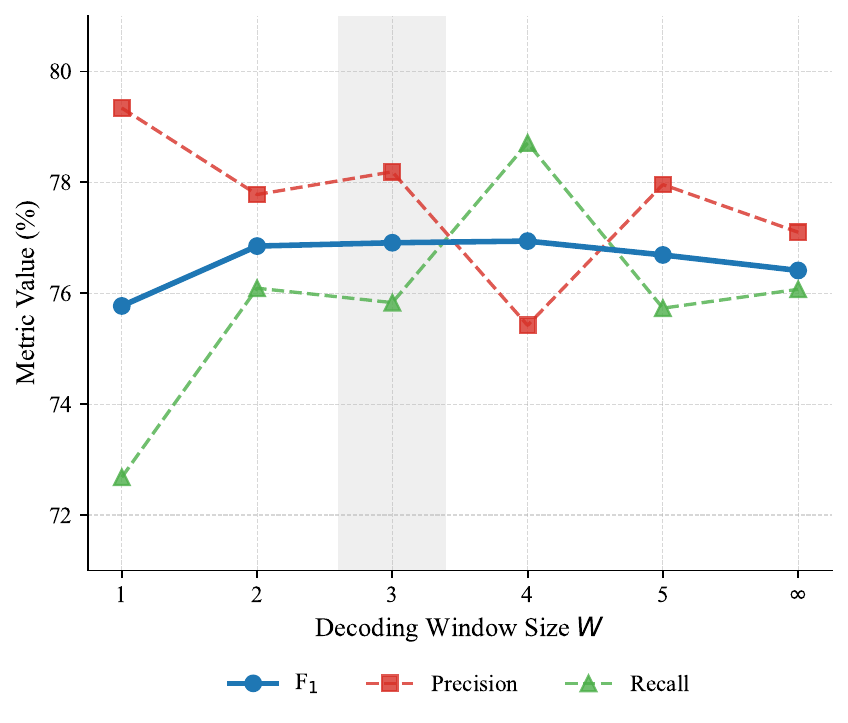

# SPEAR：面向情绪原因对抽取的 Span-Aware 关系建模框架

SPEAR 是一套面向情绪原因对抽取（Emotion-Cause Pair Extraction, ECPE）的结构化 NLP 框架，当前按 **Knowledge-Based Systems（KBS）** 投稿版本整理。项目目标是从中文文档中联合识别情绪子句、原因子句，并判断二者是否构成有效 emotion-cause pair。

ECPE 比普通分类任务更难：一个文档有 `n` 个子句时，候选 pair 数量接近 `n x n`，但真实正样本比例很低。论文版本中明确指出该任务正样本 pair 约为 **1.6%**，这会导致模型容易产生长距离 false positive。SPEAR 的设计重点就是在小数据、高负样本、强结构约束下提升关系打分稳定性。



## 核心结论

在中文 ECPE 标准 benchmark 的严格 10-fold cross validation 下，SPEAR 取得：

| 指标 | 结果 |
| --- | --- |
| Precision | **79.07%** |
| Recall | **75.59%** |
| F1 | **77.24%** |
| 相比前序最佳 PBJE | F1 **+0.87** |
| 相比 PBJE precision | **+5.23** |

这组结果的意义是：SPEAR 不是通过牺牲 precision 换 recall，而是通过 span-aware 表示、DoRA-Biaffine 打分、R-Drop 一致性约束和 window-constrained decoding，把长距离噪声 pair 压下去，同时维持稳定召回。

## 任务难点

| 难点 | 具体表现 | SPEAR 的处理 |
| --- | --- | --- |
| 候选 pair 爆炸 | `n x n` 组合里绝大多数是负样本 | Biaffine pair score + 窗口解码过滤远距离噪声 |
| 子句内部证据被压缩 | 只看 boundary token 会丢失内部触发词 | Span-Aware Clause Encoder 融合边界锚点和 span mean |
| 正样本极少 | 模型容易过度自信，产生 false positive | R-Drop 约束两次 dropout 输出一致性 |
| 小数据训练不稳定 | 高容量 scorer 容易震荡或过拟合 | DoRA 分解 direction / magnitude 稳定打分矩阵 |

## 方法设计

### Span-Aware Clause Encoder

传统 ECPE 方法通常使用子句边界 token 或粗粒度 clause embedding。SPEAR 在 clause 内部引入 span-mean pooling，并通过 residual fusion 融合边界锚点和子句内部 token 证据。

这个设计的实际价值是：很多原因表达并不是由单个边界位置决定的，而是藏在子句内部的词语、短语或转折结构中。Span-aware 表示让模型能看到更细粒度的隐式因果线索。

### DoRA-Balanced Biaffine Scorer

SPEAR 将 emotion clause 和 cause clause 分别映射到两个 role-specific 空间，然后用 biaffine scorer 计算 pair score。与普通 biaffine 不同，项目把 DoRA 的 direction / magnitude 分解思想引入到随机初始化的关系打分矩阵中，用作结构正则，而不是传统意义上的参数高效微调。

这个做法的优势是：在小数据和极端类别不平衡下，打分矩阵不容易因为少量 batch 梯度而方向漂移，从而提高 fold-level 稳定性。

### R-Drop Consistency Regularisation

R-Drop 对同一输入做两次 dropout forward，并对输出分布施加 KL 一致性约束。ECPE 的正样本 pair 极少，如果模型对错误 pair 过度自信，会显著拉低 precision。R-Drop 的作用是抑制这种过度自信，让 pair score 更平滑。

### Window-Constrained Decoding

情绪和原因通常具有局部关联，过远子句 pair 更容易成为噪声。SPEAR 在推理阶段加入 window constraint，过滤不合理长距离候选。这个策略不增加训练参数，也不增加复杂模型结构，但能显著减少长距离 false positive。

## 主实验结果

下表为中文 ECPE benchmark 上的 10-fold cross validation 结果，指标为百分制。

| 类别 | 方法 | P | R | F1 |
| --- | --- | --- | --- | --- |
| Pipeline | Indep | 68.32 | 50.82 | 58.18 |
| Pipeline | ECPE-2D | 72.92 | 65.44 | 68.89 |
| Graph / Rank | RankCP | 71.19 | 76.30 | 73.60 |
| Graph / Rank | PBJE | 73.84 | **79.22** | 76.37 |
| Prompt / Gen. | UECA-Prompt | 77.99 | 71.82 | 74.70 |
| Prompt / Gen. | JCB | 74.85 | 76.42 | 75.62 |
| Unified / Multi | UniECPE | 75.31 | 77.20 | 76.24 |
| Unified / Multi | JFTA | 76.41 | 75.81 | 76.05 |
| Ours | Base RoBERTa + Biaffine | 73.23 | 76.25 | 74.63 |
| Ours | **SPEAR Full** | **79.07** | 75.59 | **77.24** |

关键解读：

| 现象 | 解释 |
| --- | --- |
| PBJE recall 最高但 precision 较低 | 全局图式建模容易把远距离候选也判成正例 |
| UECA-Prompt precision 高但 recall 低 | 生成/提示方法更保守，容易漏掉隐式原因 |
| SPEAR precision 达到 79.07 | 窗口约束和一致性正则有效压制 false positive |
| SPEAR F1 达到 77.24 | 在 precision 和 recall 之间取得更优平衡 |

## 消融实验



| 模型 | P | R | F1 | Std |
| --- | --- | --- | --- | --- |
| Base | 73.23 | 76.25 | 74.63 | 7.00 |
| +RDrop | 77.74 | 74.25 | 75.81 | 6.70 |
| +DoRA + RDrop | 77.31 | 74.88 | 75.85 | 6.96 |
| **SPEAR Full** | **79.07** | 75.59 | **77.24** | 6.14 |
| w/o DoRA | 78.12 | 76.08 | 77.02 | 6.22 |
| w/o SpanRepr | 77.61 | 75.44 | 76.39 | 6.74 |
| w/o Biaffine | 76.20 | 76.14 | 76.06 | 6.25 |
| w/o RDrop | 73.23 | **78.63** | 75.71 | 5.65 |

消融结论：

| 组件 | 作用 |
| --- | --- |
| R-Drop | precision 从 73.23 提升到 77.74，明显抑制过度自信 false positive |
| DoRA | F1 提升幅度不大，但降低方差，体现稳定器作用 |
| SpanRepr | 移除后 F1 下降 0.85，说明子句内部 token 证据确实有效 |
| Biaffine | 替换为 MLP 后下降 1.18，说明 pair 交互打分比简单拼接分类更适合 ECPE |

## 稳定性与可解释分析





fold-level 箱线图用于观察不同折上的稳定性。SPEAR 相比 base model 收窄了低分尾部，说明它不是只在某几个 fold 上偶然冲高，而是整体降低了不稳定折的失败风险。

t-SNE 图展示 emotion / cause 表示在 role-specific 空间中的分布。加入 DoRA-Biaffine、SpanRepr 和 R-Drop 后，正样本子句更容易形成紧凑簇，便于 biaffine scorer 从背景负样本中分离真实 pair。

## 超参数敏感性





DoRA rank 分析显示，`r=4` 达到最高 F1，同时只引入很少额外参数。这个现象说明，在 ECPE 小数据场景下，过高 rank 会带来额外容量和过拟合风险，低秩约束反而更适合作为稳定正则。

窗口敏感性分析用于验证 structural locality prior：窗口过小会漏掉跨句原因，窗口过大又会引入长距离噪声。合适的窗口能在 precision 与 recall 之间取得更稳平衡。

## 工程实现

| 模块 | 说明 |
| --- | --- |
| `ECPE_Dataset` | 读取 10-fold 数据，构造 clause、pair label 和 mask |
| `ECPE_Model` | RoBERTa encoder + span-aware clause representation + pair scorer |
| `DoRA_Biaffine` | direction / magnitude 分解的 biaffine 关系打分器 |
| `run_fold` | 单 fold 训练、验证、测试流程 |
| `run_ablation` | 组件消融实验 |
| `run_sensitivity` | DoRA rank、窗口、阈值敏感性分析 |
| `significance_test` | Wilcoxon signed-rank 显著性检验 |
| `create_image.py` | 论文图表生成脚本 |

## 仓库结构

```text
.
├── ecpe.py                  # 主训练、评测、消融、敏感性、显著性检验
├── create_image.py          # 论文图表生成
├── data/                    # ECPE 10-fold 数据
├── figures/                 # 原始论文图表 PDF
├── docs/assets/             # README 可预览图
└── paper_run/               # 实验输出与中间结果
```

## 运行方式

```bash
python ecpe.py --gpu 0 --out_dir ./paper_run
```

脚本会按配置执行 10-fold 训练评测，并输出 fold-level 指标、聚合结果、消融实验和补充分析文件。

## 项目状态

- 论文状态：KBS 投稿版本；
- 代码状态：训练评测、消融、敏感性、显著性检验和图表生成已整理；
- 许可协议：MIT License。
